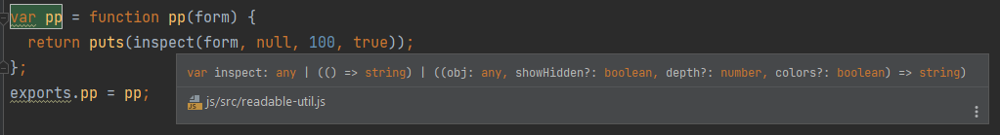
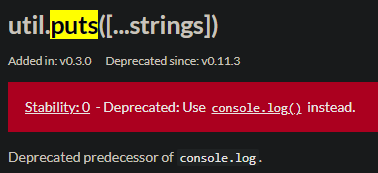

21 april 2022

I downloaded choc core project. Open IDE on the other screen.

What I do, I try to make tests work, by mostly copying code, I first need to understand,
after that I modify, I don't think going from scratch would be a good idea, I would miss
a lot of things (that I could not have thought of, like a unknown lib usage).

readable.js go first to parse with esprima, esprima seem up to date.

he said esprima is ok: https://tomassetti.me/parsing-in-javascript/

unsure what esprima is used for.

I found the doc !

https://docs.esprima.org/en/latest/syntactic-analysis.html

    jsx	Boolean	false	Support JSX syntax
    range	Boolean	false	Annotate each node with its index-based location
    loc	Boolean	false	Annotate each node with its column and row-based location
    tolerant	Boolean	false	Tolerate a few cases of syntax errors
    tokens	Boolean	false	Collect every token
    comment	Boolean	false	Collect every line and block comment

playground here: https://esprima.org/demo/parse.html

---

he use this lib: https://www.npmjs.com/package/util (but not declared in package.json) (Bad practice !)
no typing: https://github.com/browserify/node-util/issues/54

esprima.parseScript return an object:

```js
{
  "body": [
    {
      "declarations": [
        {
          "id": {
            "loc": {
              "end": {
                "column": 5,
                "line": 1
              },
              "start": {
                "column": 4,
                "line": 1
              }
            },
            "name": "i",
            "range": [
              4,
              5
            ],
            "type": "Identifier"
          },
          "init": {
            "loc": {
              "end": {
                "column": 9,
                "line": 1
              },
              "start": {
                "column": 8,
                "line": 1
              }
            },
            "range": [
              8,
              9
            ],
            "raw": "2",
            "type": "Literal",
            "value": 2
          },
          "loc": {
            "end": {
              "column": 9,
              "line": 1
            },
            "start": {
              "column": 4,
              "line": 1
            }
          },
          "range": [
            4,
            9
          ],
          "type": "VariableDeclarator"
        }
      ],
      "kind": "var",
      "loc": {
        "end": {
          "column": 9,
          "line": 1
        },
        "start": {
          "column": 0,
          "line": 1
        }
      },
      "range": [
        0,
        9
      ],
      "type": "VariableDeclaration"
    }
  ],
  "loc": {
    "end": {
      "column": 9,
      "line": 1
    },
    "start": {
      "column": 0,
      "line": 1
    }
  },
  "range": [
    0,
    9
  ],
  "sourceType": "script",
  "type": "Program"
}
```

util.inspect return a string:

```
VariableDeclaration {
  type: 'VariableDeclaration',
  declarations: [
    VariableDeclarator {
      type: 'VariableDeclarator',
      id: [Identifier],
      init: [Literal],
      range: [Array],
      loc: [Object]
    }
  ],
  kind: 'var',
  range: [ 0, 9 ],
  loc: { start: { line: 1, column: 0 }, end: { line: 1, column: 9 } }
}
```

I don't know how my IDE know that, since the lib is not installed and
I don't have the versio nof that lib either, but:



`util.puts` deprecated



---

ah nvm I thought jest wasn't logging anything, it just log at the file
level, not at the test level.

Ok and color does work in my console, interesting, but not useful ?

---

```js
var o = makeOpts(opts);
```
ignore as I don't use options right now

Oh my, he is chaing ternary operators
in readable.js .

Is suppose

```js
            var messages = vec(map(function(dec) {
              var name = dec.id ?
                (dec.id).name :
                void(0);
              var createMessage = list("" + "Create the variable <span class='choc-variable'>" + name + "</span>");
              var initMessage = dec.init ?
                list(" and set it to <span class='choc-value'>", generateReadableExpression(dec), "</span>") :
                list();
              var message = concat(createMessage, initMessage);
              return compileEntry(list("lineNumber", (node.loc).start ?
                ((node.loc).start).line :
                void(0), "message", message, "timeline", symbol(name)));
            }, node.declarations));
            return list(list(symbol(void(0), "fn"), [], messages));
```
Is using Array.map

```js
              var name = dec.id ?
                (dec.id).name :
                void(0);
```
name doesnt exist, ah, actually he is searching for a type.

id refer to type `Pattern`.

```ts
export type Pattern =
    Identifier | ObjectPattern | ArrayPattern | RestElement |
    AssignmentPattern | MemberExpression;
```

I checked every type, only Identifier has name.

Also, I can just check the `type` property instead. Safer.

IT use https://github.com/wisp-lang/wisp/ , oh no.

I have no idea what is that used for. Ignore for now ?

That is hard to read:

```js
              return compileEntry(list("lineNumber", (node.loc).start ?
                ((node.loc).start).line :
                void(0), "message", message, "timeline", symbol(name)));
```

```js
compileEntry
(
  list
  (
    'lineNumber', 
    (node.loc).start ? ((node.loc).start).line : void (0),
    'message',
    message,
    'timeline',
    symbol(name)
  )
);
```


Ternary condition horror on `generateReadableExpression`.

Also, the param to `generateReadableExpression(node, opts)`
is not `node`, but `dec`. Maybe not because `isEqual(type, "AssignmentExpression")` make no sense.
type if dec is necessary `VariableDeclarator`.

Using https://esprima.org/demo/parse.html# will help understand.

```json
          "init": {
            "type": "BinaryExpression",
            "operator": "*",
            "left": {
              "type": "Literal",
              "value": 6,
              "raw": "6"
            },
            "right": {
              "type": "Literal",
              "value": 7,
              "raw": "7"
            }
          }
```

When no expression

```json
          "init": {
            "type": "Literal",
            "value": 6,
            "raw": "6"
          }
```

It was `dec.init.type`. 
Actually, didn't think about a library api change...

```js
          isEqual("-=", op) ?
            list("subtract ", generateReadableExpression((node || 0)["right"]), " from ", generateReadableExpression((node || 0)["left"], {
              "want": "name"
            }), " and set ", generateReadableExpression((node || 0)["left"], {
              "want": "name"
            }), " to ", generateReadableValue((node || 0)["left"], (node || 0)["right"])) :
```

he could have make a one or two letter variable to shorten...

---

omg the length of the line.

```js
var argumentSources = map(function(arg) {
                return escodegen.generate(arg, {
                  "format:": {
                    "compact:": false
                  }
                });
              }, node.arguments);
              return list(list(list(symbol(void(0), "fn"), [], list(symbol(void(0), "let"), vec([symbol(void(0), "callee"), list(symbol(void(0), "eval"), calleeCompiled), symbol(void(0), "callee-object"), list(symbol(void(0), "eval"), calleeObjectCompiled), symbol(void(0), "arguments"), list(symbol("wisp.sequence", "map"), list(symbol(void(0), "fn"), vec([symbol(void(0), "arg")]), list(symbol(void(0), "eval"), symbol(void(0), "arg"))), argumentSources)]), list(symbol("readable", "annotation-for"), symbol(void(0), "callee"), symbol(void(0), "callee-object"), calleeCompiled, propertyN, symbol(void(0), "arguments"))))));
            
```
no idea what the line does.

This is terrible to use ternary, I think i can use my ide to convert

```js
  isEqual(type, "VariableDeclarator") ? // start 1
  isEqual((o || 0)["want"], "name") ?
    generateReadableExpression(node ?
      node.id :
      void(0), {
      "want": "name"
    }) : // middle 2
  isEqual(node.init ?
    (node.init).type :
    void(0), "FunctionExpression") ? // end 2
    list("this function") :
  true ?
    generateReadableExpression(node ?
      node.id :
      void(0)) :
    void(0) :
true ?
  list("") :
  void(0)
```

Return are missing, but it is something like:

```js
if (isEqual(type, 'VariableDeclarator')) {
  if (isEqual((o || 0)['want'], 'name')) {
    if (node) {
      generateReadableExpression(node.id, {
        'want': 'name',
      });
    } else {
      generateReadableExpression(void (0), {
        'want': 'name',
      });
    }
  } else {
    let same = isEqual(node.init ?
      (node.init).type :
      void (0), 'FunctionExpression');

    if (same) {
      list('this function')
    } else {
      if (node) {
        node.id
      }
    }
  }
} else {
  list('');
}
```

No idea. How he give the information
about a variable and make the addition.

```
var bar = 2, foo = 0;
foo = 1 + bar // set foo to 3
```
how does he do that.

This is what esprima does.
```
{
  "type": "Program",
  "body": [
    {
      "type": "VariableDeclaration",
      "declarations": [
        {
          "type": "VariableDeclarator",
          "id": {
            "type": "Identifier",
            "name": "bar"
          },
          "init": {
            "type": "Literal",
            "value": 2,
            "raw": "2"
          }
        },
        {
          "type": "VariableDeclarator",
          "id": {
            "type": "Identifier",
            "name": "foo"
          },
          "init": {
            "type": "Literal",
            "value": 0,
            "raw": "0"
          }
        }
      ],
      "kind": "var"
    },
    {
      "type": "ExpressionStatement",
      "expression": {
        "type": "AssignmentExpression",
        "operator": "=",
        "left": {
          "type": "Identifier",
          "name": "foo"
        },
        "right": {
          "type": "BinaryExpression",
          "operator": "+",
          "left": {
            "type": "Literal",
            "value": 1,
            "raw": "1"
          },
          "right": {
            "type": "Identifier",
            "name": "bar"
          }
        }
      }
    }
  ],
  "sourceType": "script"
}
```

Maybe he use... the current variable
on global ?
When using Math.random()
it change each time I move the slider
and display the random value.

so it is evaluated I think.

yep

```js
var r = Math.random();
var d = r;
```
change each time the slider move

Maybe, I can evaluate too ?
need to evaluate the code "before" like he said.
but... how does he manage not to evaluate
stuff that require a lib ?
or does he not care maybe.
maybe he don't care that something 
is drawn on canvas.

let's read about eval a bit
https://developer.mozilla.org/en-US/docs/Web/JavaScript/Reference/Global_Objects/eval

eval could be used, but
Function() recommended by MDN seem viable.

```js
Function('var k = {o:{p:34}}; return k')()
```
I just need to append the return of the variable I need.
It could be an object (k.o.p). But that should be doable.
However, still no idea about libs

run the code, give it dependency (that is what they do with `pad`).
before running it, you need return some information
about the var you need.
this can be separated step where
I modify markers put in the final string
```html
set to <span class="variable-replacable">i</span>
```

---

Esprima actually give me AST, that is the KEyWORD !
I want to evalute step by step AST.

MAYBE I CAN AVOID PROPS DRILING
options, by making a class
and using new.

ast explorer using
concurrent acorn: https://astexplorer.net/

I am having issue with `while` loop,
we all agree that I am making the text for
only one line.
But if I evaluate the code right before the while loop,
the `var i = 0` will always be `0`.

---

I look the deps, I have seen something intersting:
https://github.com/estools/escodegen

He say use escogen
https://github.com/jquery/esprima/issues/2072

babel generator could also work it seems
https://stackoverflow.com/questions/49629651/how-can-i-transform-a-custom-ast-into-js-code

but it might be a big file for the browser.
On react docusaurus, they talked about typescript editable
code snippet, and he said no, they wont' do it because too  much
stuff to download for user.

OHH, I missed some .coffee file.
why did he put them into a coffee folder instead of src...

`generateCallTrace` seem interesting in choc.coffee

wisp and coffee is kinda unreadable...

This suck, I have no idea how the timeline is generated.

```
var i = 0;
[1,2,3].foreach(() => {
 i++;
})
```
this doesn't work, ha.

I mean, he need to stop and draw,

(btw: playing with http://jsfiddle.net/eigenjoy/smdbd/)

So he call draw in code.

I guess, I have to go on on myself now. mostly.

---

Rewrite code as a big yield ?

```
function* generator() {
yield 1;
yield 2;
yield 3;
}
```
I put a yield with the info I need
and also know when code is finished.

Not sure if that can work to get strack trace
https://stackoverflow.com/questions/41586293/how-can-i-get-a-js-stack-trace-without-halting-the-script

```js
const stackTrace = new Error().stack
```

---

CONTRAINTES:
- Pas de visuel, pas de generation visuel.

1. Quel est le call trace. (dans quel ordre chaque element est appelé)
  - On peut générer le slider avec, nb de instructions + position ligne
    + surligner.
2. À chaque call, une explication, sur une ou plusieurs lignes.
3. Pas de evaluation directe dans un premier temps (oublie pr l'instant)

Si call trace, je répète instructions dans un boucle.
Est-ce que decrire le code hors fonctionnement est intéressant ?
non je pense pas. Cela revient à coder tt court

```js
Function(`const stackTrace = new Error().stack`)()
Function(`function sd() {const stackTrace = new Error().stack} return sd`)()
```
doesnt give anything useful.

---

```js
function d() {
 var p = 3 + a
}
d()
var a = 4;
```
this work. amazing.
maybe he is adding some hiddne code ??

like

```js
function d() {
  hiddenEvaluator(a);
 var p = 3 + a
}
d()
var a = 4;
```

I can put marker like that everywhere ?
This also give me the callstack

---

24 april 2022

les if, si je veux savoir si c'est true ou false, suffit que je regarde le next call.
pas besoin d'evaluer l'expression.

pour une function, si je veux savoir si appeler, c'est un spy après la declaration de la fc (càd ds la fc).

pour une boucle, je sais que cela stop si un spy est appeler après la boucle.

---

escodegen: http://jsfiddle.net/wittnl/q5d2pq6n/

---

25 april 2022

should I generate the message in the spy ?
This could be less code to parse the AST. Maybe.

---

some stuff get hard to read. the nested if, are not readable. I need something to reformat.

beautify js ? or prettier js ?

prettier has default tab == 2, and 4 times the stars.

options here: https://prettier.io/docs/en/options.html

maybe i use it for the lib itself, and not just for tests.

Can also use // language=js from webstorm.
I thought it didn't worked so I use escaped version %60, but it actually worked.
%60 cannot be parsed as js by webstorm. I like the reformat of webstorm, help
reading the expected code.

---

26 april 2022

dont use commonJs if you target browser, that's for node, noob. Lost 2h on that, and also because I use rollup and workspace and didn't
know where the bug came from.

---

plus ds log dans learning-programming/ ... logs

---

30 april

https://youtrack.jetbrains.com/issue/WEB-49188

---

02 mai 2022

#### Workspaces

It was working until CRA arrived, complaining about multiple version of react. Maybe noHoist option in package.json
could help, but only supported by Yarn right now.
